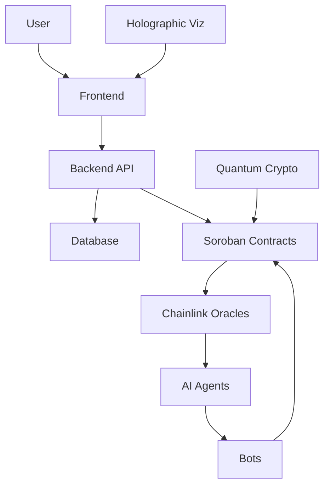

# PiDefi Architecture

## Overview
PiDefi is a hyper-tech DeFi ecosystem on Stellar's Soroban, featuring Pi Coin (a stablecoin pegged to $314,159), AI-driven liquidity management, quantum-resistant security, and holographic visualizations. The architecture is modular, scalable, and future-proof, integrating Chainlink oracles, cross-chain bridges, and off-chain bots.

## Core Components

### 1. Smart Contracts (contracts/)
- **PiSoroban.rs**: Core stablecoin with mint/burn, transfers, and stabilization.
- **DeFiExtensions.rs**: Yield farming, lending, and flash loans.
- **QuantumSafeModule.rs**: Quantum crypto for secure txns.
- **CrossChainBridge.rs**: CCIP-based bridging to Ethereum/Solana.
- **PriceFeedAdapter.rs**: Chainlink oracle integration.

### 2. Off-Chain AI Agents (offchain/ai_agents/)
- **LiquidityOptimizer.py**: ML for liquidity adjustments.
- **RiskSimulator.py**: Monte Carlo simulations with AI.
- **YieldPredictor.js**: Predictions for farming APYs.

### 3. Bots (bots/)
- **StabilizationBot.go**: Autonomous Pi Coin peg maintenance.
- **ArbitrageBot.py**: Cross-chain arbitrage execution.

### 4. Oracles (oracles/)
- **PriceFeedAdapter.rs**: On-chain price feeds.
- **AutomationScripts.js**: Keeper automation.
- **DataAggregator.py**: Multi-source data aggregation.

### 5. Frontend (frontend/)
- React app with 3D holographic UIs using Three.js.
- Integrates with backend APIs for real-time data.

### 6. Backend (backend/)
- **API (server.js)**: RESTful endpoints with AI recommendations.
- **Services**: NotificationService.py for alerts.
- **Database**: PostgreSQL schema with AI data tables.

### 7. Scripts (scripts/)
- **deploy.sh**: Automated Soroban deployment.
- **chainlink_setup.js**: Oracle configuration.
- **quantum_keygen.py**: Key generation.

### 8. Lib (lib/)
- **crypto/quantum_crypto.rs**: Lattice-based crypto.
- **utils/price_calculations.rs**: Advanced pricing math.
- **sdk/pi_defi_sdk.rs**: Developer SDK.

### 9. Config (config/)
- **stellar.toml**: Network and contract settings.
- **chainlink.json**: Oracle configs.
- **ai_config.yaml**: ML hyperparameters.

### 10. Tests (tests/)
- Unit tests for contracts with AI data generation.

## Hyper-Tech Features

### AI-Driven Optimizations
- **Liquidity Management**: TensorFlow models predict and adjust liquidity autonomously.
- **Risk Assessment**: RNNs simulate market scenarios for proactive hedging.
- **Yield Prediction**: ML forecasts APYs for optimal staking.
- **Test Prioritization**: AI ranks tests in CI/CD for efficiency.

### Quantum-Resistant Security
- **Crypto Layer**: Dilithium/Kyber for signatures/encryption in QuantumSafeModule.rs.
- **Key Management**: Generated via quantum_keygen.py, stored encrypted.
- **Txn Integrity**: SHA-3 hashing in price_calculations.rs.

### Holographic Visualizations
- **3D Rendering**: Three.js in frontend for immersive dashboards.
- **Data Layers**: JSON structures from backend for risk/price projections.
- **ASCII Viz**: Console outputs in bots for quick checks.

### Cross-Chain Interoperability
- **CCIP Integration**: Chainlink for secure bridging.
- **Multi-Asset Support**: Handles Pi Coin across chains.

## Data Flows

### Transaction Flow
1. User initiates txn via SDK.
2. Frontend calls backend API.
3. API validates with quantum crypto.
4. Soroban contract executes, stabilized by AI bots.
5. Oracles feed real-time data.
6. Holographic viz updates UI.

## Security
- **Audits**: Formal verification for contracts.
- **Encryption**: Quantum-resistant for all sensitive data.
- **Monitoring**: Real-time alerts via NotificationService.

## Deployment
- Use deploy.sh for Soroban.
- CI/CD via .github/workflows/ci.yml.
- Multi-env support with stellar.toml.

## Future Roadmap
- Expand to more chains.
- Integrate advanced AI (e.g., GANs for simulations).
- Enhance holographics with VR support.

For API refs, see backend/api/server.js. For configs, see config/.
